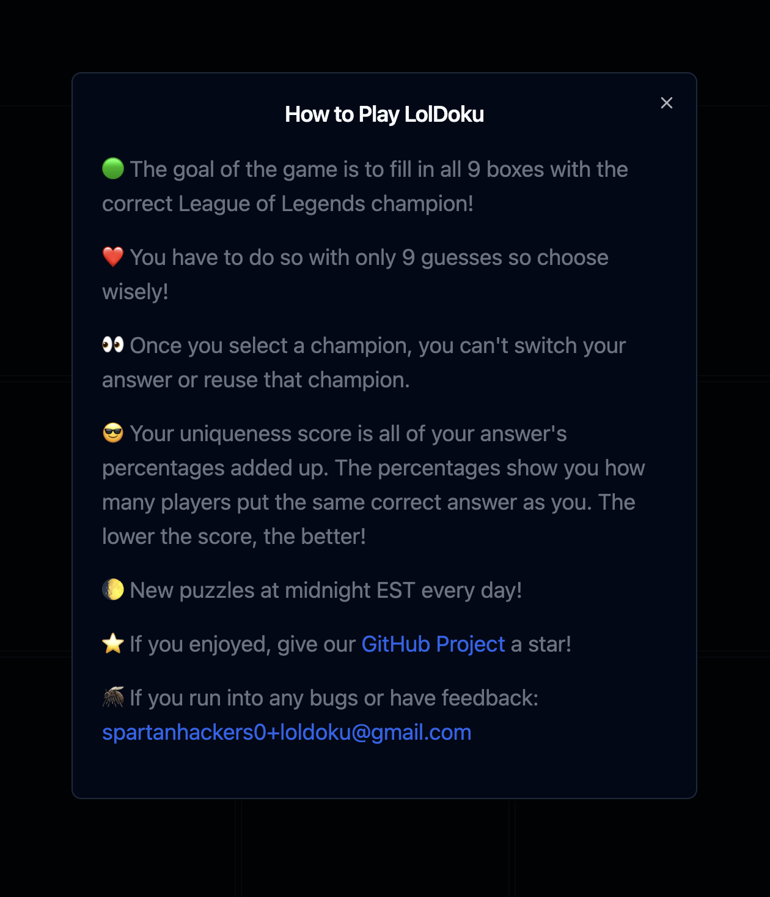
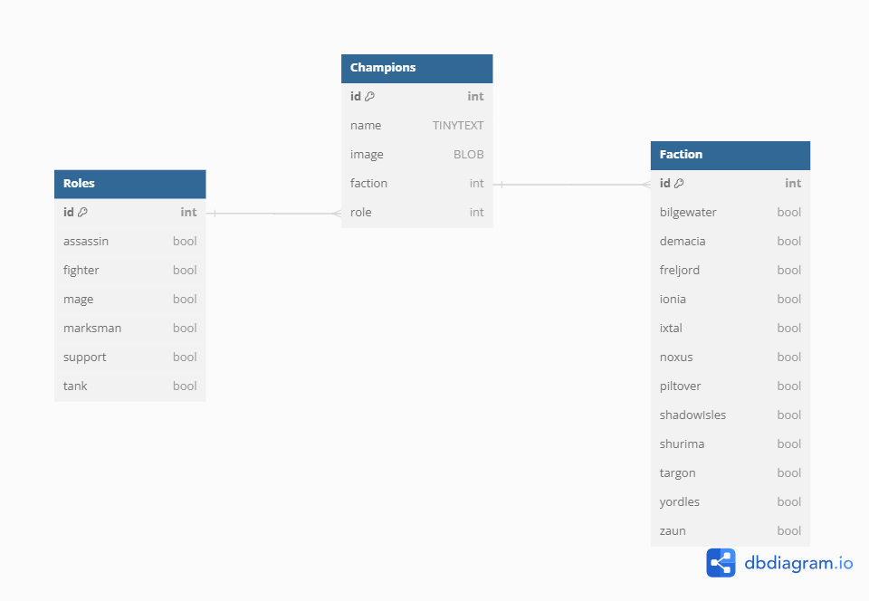

<h1 align="center">
  <br>
  
</h1>

<h4 align="center"> Immaculate Grid: League of Legends Edition</h4>
<hr>
<div align="center">
    
    
    
    
    
    
    
    
    
    
    
    
</div>
<hr>
<p align="center">
  •
  <a href="#about">About</a>
  •
  <a href="#screenshots">Screenshots</a>
  •
  <a href="#features">Features</a>
  •
  <a href="#game-rules">Game Rules</a>
  •
  <a href="#installation-guide">Installation Guide</a>
  •
  <a href="#scripts">Contributions</a>
  •
  <a href="#schema">Schema</a>
  •
  <a href="#license">License</a>
  •
</p>

---

## About

LOLDoku is an open source spin on the classic Immaculate Grid using champions from the popular MOBA game League of Legends. The goal of the game is to fill in the 3x3 grid with answers that match the clues given. New puzzles are generated daily, and users can sign in (OAuth2.0) to access their stats and archived puzzles.

> [!Important]
>
> LOLDoku is not endorsed by Riot Games and does not reflect the views or opinions of Riot Games or anyone officially involved in producing or managing Riot Games properties.
> Riot Games and all associated properties are trademarks or registered trademarks of Riot Games, Inc.

## Screenshots

<details>
<summary> <b>Click to view Images</b> </summary> 
<br>
<b>Rules Modal:</b>
<br>


<hr>
</details>
<br>
<details>
<summary> <b>Click to view GIFs</b> </summary>
<br>
<b>Google OAuth:</b>
<br>

</details>
<br>

## Features

• Secure GitHub and Google sign in! Sign in with your GitHub or Google account to access your stats and archived puzzles.

• Dark Mode! Enjoy LOLDoku in your light or dark theme of choice.

• Daily puzzles! New puzzles are generated daily at midnight EST.

• Uniqueness Score: Your uniqueness score is all of your answer's percentages added up. The percentages show you how many players put the same correct answer as you. The lower the score, the better!

• Stats! Sign in to access user stats and archived puzzles.

• Leaderboards! See how you stack up against other players.

• If you run into any bugs or have feedback: [spartanhackers0+loldoku@gmail.com](mailto:spartanhackers0+loldoku@gmail.com)

## Installation Guide

1. Fork the LOLdoku repository to your own GitHub account.
2. Clone the repository to your local environment.

```bash
git clone https://github.com/<your-github-username>/LOLDoku.git
```

4. Navigate to the root project directory and install dependencies

```bash
cd LOLDoku
npm install
```

5. Please look through the `package.json` file to see what scripts are available. Any script can be run with `npm run <scriptname>`. To run application in development, run the following command:

```bash
npm run dev
```

6. Please look at the terminal logs to see what port the application is running on.

## Scripts

The `scripts` section of the `package.json` file define various commands to streamline development and deployment processes. The following is an overview of each script:

- `dev`
  For development purposes. Compiles TypeScript code and concurrently runs Vite dev server for front-end and Nodemon for back-end. Allows for real-time reloading during development.

- `start`
  Used for running application in production-like environment. Compiles TypeScript code and starts server using Nodemon, which will automatically restart server if any changes are detected in server files.

- `test`
  Runs Jest test runner in watch mode, continuously monitoring for any changes in `.test.ts/.test.tsx` files and re-runs tests as needed. Useful during development for immediate feedback on code changes.

- `build`
  Triggers Vite build process for front-end application. Compiles and bundles React application into static files optimized for production.

- `build:watch`
  Runs TypeScript compiler in watch mode, continuously monitoring for any changes in `.ts/.tsx` files and recompiles them as needed. Useful during development for immediate feedback on code changes.

- `preview`
  Locally preview production build of front-end application. Serves static files generated by Vite build command, allowing local testing of production build before deployment.

## Schema



## License

This project is licensed under the terms of the [MIT LICENSE](./LICENSE)
